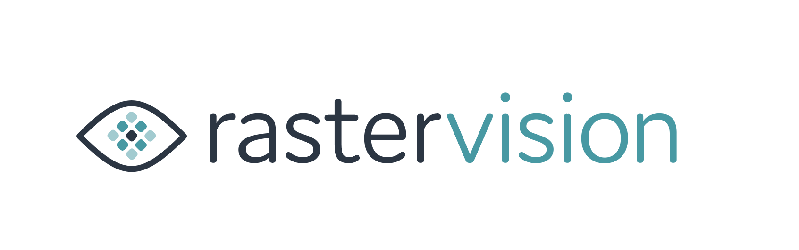

Raster Vision is an open source Python library that makes it easy to analyze satellite and aerial imagery using deep learning. It is designed for extensibility, but has built-in support for chip classification, object detection, and semantic segmentation using Tensorflow.

### Guiding Principles
* **Easy to use.** Experience with deep learning is not required. The API supports concise configurations with defaults that embody best practices, while still allowing fine-grained control for advanced users.

* **Enables rapid experimentation**. The library encapsulates an experimental workflow including chip generation, training, prediction and evaluation, which makes it easy to try out ideas and get feedback on them.  A [QGIS plugin](https://github.com/azavea/raster-vision-qgis) is available to visualize the results of experiments.

* **Avoids reinventing the wheel.** We inherit the full power of third-party computer vision / deep learning libraries while avoiding duplicated effort by utilizing them as subroutines.

* **Cloud-enabled.** Supports running on CPUs or GPUs, locally or in the cloud, with builtin support for AWS.

* **Extensibility.** A plugin architecture supports extension to new data sources, tasks (eg. object detection), backends (eg. TF Object Detection API), and cloud providers.

### Getting started

The installation

documentation

support

contributing

get rid of previous work on semantic segmentation and edit blog to point to tags
